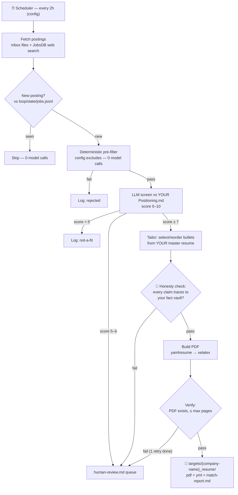

# 🔄 job-hunting-loop

A **cloneable loop-engineering template**: a scheduled agent loop that searches job boards, screens postings against *your* positioning, tailors *your* resume per job description, and drops application-ready PDFs into a review folder — with a human gate before anything leaves the loop.

**This is not a resume generator.** It's a reference implementation of loop engineering: verified progress measures, hard bounds, external state, maker/checker separation, designed exits, and a frozen anchor the loop may never rewrite. The resumes are the proof the machinery runs.

```
clone → bring your own story → configure → start the loop
```

---

## How it works



**The loop never applies, emails, or uploads.** It writes to `targets/` and stops. You review. That's by design — the human gate is permanent.

**The honesty invariant:** tailoring may only *select, reorder, and re-emphasize* facts from `profile/`. It may never invent a skill, metric, employer, or date. An independent checker model verifies every claim against your fact vault before any PDF is built — and a seed test proves the checker catches fabrications.

## Requirements

- [Bun](https://bun.sh) ≥ 1.3
- `npx yamlresume` (fetched automatically) + a LaTeX distribution with `xelatex` (MiKTeX / TeX Live)
- An OpenAI-compatible LLM API key (see `.env.example`)
- Optional: a SearXNG instance for web search (else DuckDuckGo HTML)

## Quick start

### 1. Clone & install

```bash
git clone https://github.com/oat431/job-hunting-loop.git
cd job-hunting-loop
bun install
```

### 2. Configure credentials

```bash
cp .env.example .env
```

Open `.env` and fill in `LLM_API_KEY` + `LLM_BASE_URL` (any OpenAI-compatible endpoint: OpenAI, DeepSeek, OpenRouter, DashScope…). Never commit `.env`.

### 3. Onboard — bring your own story

```bash
cp profile/_template/firstname.md             profile/Yourname.md
cp profile/_template/firstname-Positioning.md profile/Yourname-Positioning.md
cp profile/_template/firstname-Stories.md     profile/Yourname-Stories.md
cp profile/_template/resume.yml               profile/resume.yml
```

Fill in all four files — see `profile/_example/` for a filled fictional persona (Somchai) to copy the depth from. An LLM may help extract from your existing resume, but **YOU verify every line**: it's your name on the PDF.

> ⚠️ Your `-Positioning.md` is the **screening criteria** — target roles, must-haves, deal-breakers. Not an interview narrative. A vague positioning file produces a vague screen.

The loop refuses to start until the profile is complete:

```bash
bun run gate
```

### 4. First run — one real job

```bash
mkdir -p loop/inbox
```

Paste a real job description into `loop/inbox/my-first-jd.md` (optional frontmatter: `title:`, `company:`, `url:`, `location:`), then:

```bash
bun run loop
```

Watch the console: fetch → dedup → screen (score 0–10) → tailor → honesty check → build. Output lands in `targets/{company-name}_resume/`. Run it again — it should print `nothing new` with **zero model calls** (that's the dedup exit working).

### 5. Prove the honesty checker works

Required before trusting the loop:

```bash
bun run seed-test
```

Injects a fake skill + a number drift into a copy of your resume — the checker **must** catch both. If it doesn't, the loop doesn't ship.

### 6. Schedule it

```bash
# cron (Linux/macOS): every 2 hours
0 */2 * * * cd /path/to/job-hunting-loop && bun run loop --scheduled
```

On Windows use Task Scheduler (`bun run engine/run.ts --scheduled`), or your agent platform's cronjob feature. Kill-switch anytime: `enabled: false` in `config.yml`.

## Configuration

Everything lives in `config.yml`: cadence, search queries/location, score thresholds, per-run caps (screened ≤ 20, tailored ≤ 3, token budget ≤ 100K), build retries, max pages, section order, models. **The kill-switch is `enabled: false`** — checked first thing every run.

## Output

| Where | What |
|---|---|
| `targets/{company-name}_resume/` | the tailored PDF + YAML + `match-report.md` (score, matched keywords, **gaps = interview prep**, bullets selected) |
| `loop/state/jobs.jsonl` | every posting ever seen: hash, status, score — the dedup memory |
| `loop/state/runs.jsonl` | every run: counts, tokens, outcome — the trace |
| `loop/state/human-review.md` | the approvals queue: mid-band scores, honesty failures, build failures |
| `loop/state/last-run.md` | one-page summary of the most recent run |

## Design

📄 **[Full design proposal: Job-Hunting as Loop Engineering](https://github.com/oat431/oralita_md/blob/main/personal/ai/job-hunting-as-loop-engineering.md)** — the thesis (why this is loop engineering), the five locked design decisions, architecture, repo layout rationale, onboarding philosophy, the honesty-anchor invariant, bounds & budgets, and the build roadmap.

The governing checklists: **loop-engineering** (convergence: progress measure · bounds · exits) and **graph-engineering** (structure everywhere, judgment only where needed; frozen anchors).

Architecture rules for contributors live in [`AGENTS.md`](AGENTS.md) — the short version: `profile/` is read-only to the engine; model calls exist only in screen/tailor/check; every exit is designed; caps are enforced in code, not prompts; the seed test gates releases.

## License

[MIT](LICENSE) © 2026 Sahachan Tippimwong. The `_example/` profile is fictional; never commit real personal data to a public fork.
