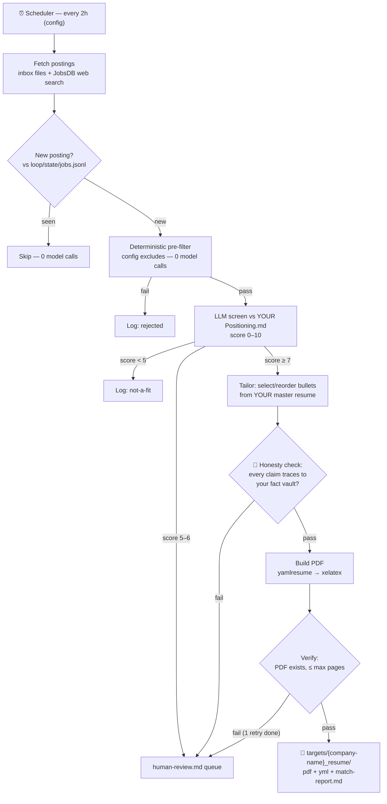

# 🔄 job-hunting-loop

A **cloneable loop-engineering template**: a scheduled agent loop that searches job boards, screens postings against *your* positioning, tailors *your* resume per job description, and drops application-ready PDFs into a review folder — with a human gate before anything leaves the loop.

**This is not a resume generator.** It's a reference implementation of loop engineering: verified progress measures, hard bounds, external state, maker/checker separation, designed exits, and a frozen anchor the loop may never rewrite. The resumes are the proof the machinery runs.

```
clone → bring your own story → configure → start the loop
```

---

## How it works



**The loop never applies, emails, or uploads.** It writes to `targets/` and stops. You review. That's by design — the human gate is permanent.

**The honesty invariant:** tailoring may only *select, reorder, and re-emphasize* facts from `profile/`. It may never invent a skill, metric, employer, or date. An independent checker model verifies every claim against your fact vault before any PDF is built — and a seed test proves the checker catches fabrications.

## Requirements

- [Bun](https://bun.sh) ≥ 1.3
- `npx yamlresume` (fetched automatically) + a LaTeX distribution with `xelatex` (MiKTeX / TeX Live)
- An OpenAI-compatible LLM API key (see `.env.example`)
- Optional: a SearXNG instance for web search (else DuckDuckGo HTML)

## Quick start

```bash
git clone <this repo> && cd job-hunting-loop
bun install
cp .env.example .env          # fill in LLM_API_KEY / LLM_BASE_URL

# 1. Onboard — bring your own story (see profile/_template/ for blanks,
#    profile/_example/ for a filled fictional persona)
cp profile/_template/firstname.md             profile/Yourname.md
cp profile/_template/firstname-Positioning.md profile/Yourname-Positioning.md
cp profile/_template/firstname-Stories.md     profile/Yourname-Stories.md
cp profile/_template/resume.yml               profile/resume.yml
#    ...fill all four in. An LLM may help extract from your existing resume —
#    but YOU verify every line. It's your name on the PDF.

bun run gate                  # ✅ the loop refuses to start until this passes

# 2. Prove the shape manually (Phase 0) — one real JD, by hand or via harness:
mkdir -p loop/inbox
#    paste a real job description into loop/inbox/my-first-jd.md
#    (optional frontmatter: title:, company:, url:, location:)
bun run loop                  # one full run; watch the console

# 3. Prove the honesty checker works (required before trusting the loop):
bun run seed-test             # injects a fake skill + number drift → checker MUST catch it

# 4. Schedule it:
#    cron:            0 */2 * * *  cd /path/to/job-hunting-loop && bun run loop --scheduled
#    Windows Task Scheduler, or your agent platform's cronjob feature.
```

## Configuration

Everything lives in `config.yml`: cadence, search queries/location, score thresholds, per-run caps (screened ≤ 20, tailored ≤ 3, token budget ≤ 100K), build retries, max pages, section order, models. **The kill-switch is `enabled: false`** — checked first thing every run.

## Output

| Where | What |
|---|---|
| `targets/{company-name}_resume/` | the tailored PDF + YAML + `match-report.md` (score, matched keywords, **gaps = interview prep**, bullets selected) |
| `loop/state/jobs.jsonl` | every posting ever seen: hash, status, score — the dedup memory |
| `loop/state/runs.jsonl` | every run: counts, tokens, outcome — the trace |
| `loop/state/human-review.md` | the approvals queue: mid-band scores, honesty failures, build failures |
| `loop/state/last-run.md` | one-page summary of the most recent run |

## Design

The full design doc (thesis, decisions, architecture) lives in the author's vault as the `job-hunting-as-loop-engineering` proposal. Checklists that govern this repo: **loop-engineering** (convergence: progress measure · bounds · exits) and **graph-engineering** (structure everywhere, judgment only where needed; frozen anchors).

Architecture rules for contributors live in [`AGENTS.md`](AGENTS.md) — the short version: `profile/` is read-only to the engine; model calls exist only in screen/tailor/check; every exit is designed; caps are enforced in code, not prompts; the seed test gates releases.

## License

[MIT](LICENSE) © 2026 Sahachan Tippimwong. The `_example/` profile is fictional; never commit real personal data to a public fork.
